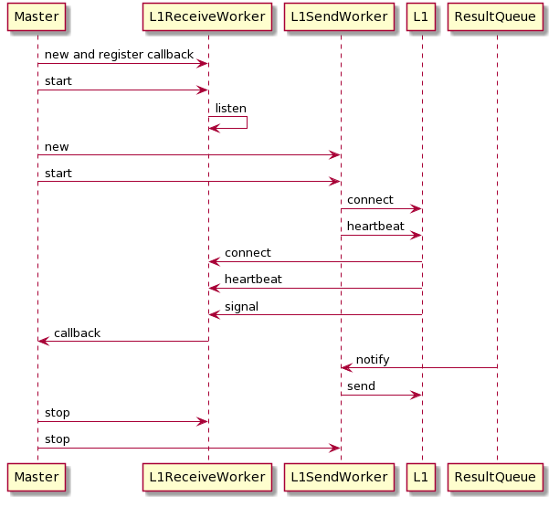

#Overview
L1ReceiverWorker: Listen on tcp socket on one dedicate thread. Registered
callback will be called if any interesting happen.

#Structure
.
└── doc          -- doc and images
├── include      -- 3rd party header
├── lib          -- 3rd party lib
├── Makefile
├── README.md
├── sample       -- sample code
├── src          -- core code
└── test         -- module test

#Sequence

